# PIC and AVR LTE Demo Files

This repository contains the .hex files that you can use to program your Microchipo AVR or PIC boards with to demo cellular function using the Ublox SARA-R4 LTE CAT-M1 click board.

Below you will see a short description of each .hex file and which board it can be used with.

Applications Rev 1.00
Documentation 1.10

Notes - Updated documentation with pictures, links, and demo walk through.

Coming soon - Walk through of UART pass through on IoT boards.

---

<a href="url">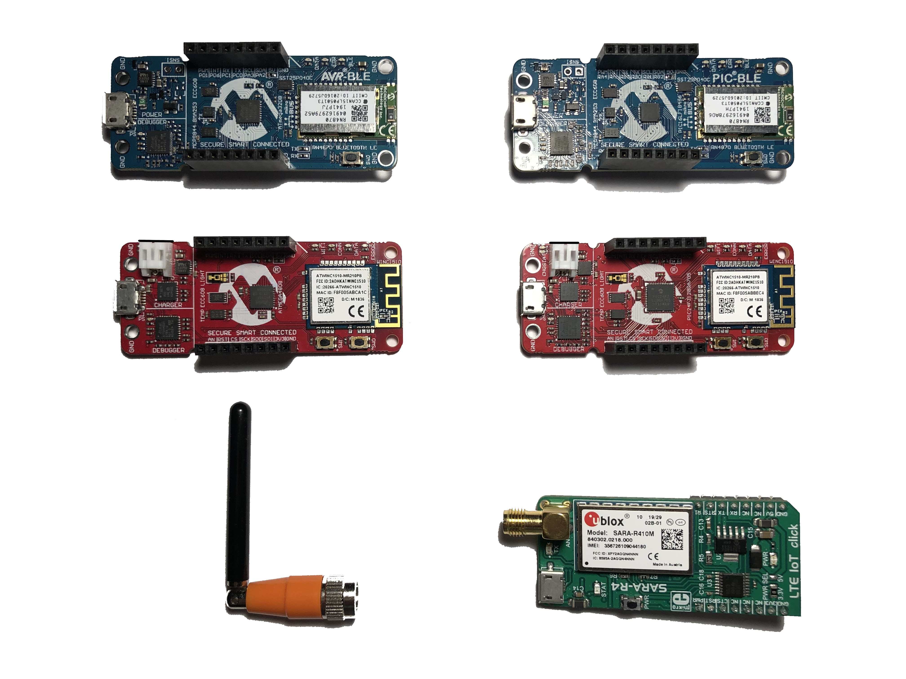</a>

---

## Individual .hex Files and their Associated Boards

**AVR-BLE_LTE_Click.hex** \|  [AVR-BLE](https://www.futureelectronics.com/p/development-tools--microcontroller-microprocessor--8-bit-eval-board/dt100111-microchip-5123703)

Demo Features: This application will provide a wired UART pass through that will allow you to control the cellular module via AT commands. Addtionally, there is a small API to send commands to the cellular module over the UART which you can use to develop your own application.

**AVR-IoT_LTE_Click.hex** \| [AVR-IoT WA](https://www.futureelectronics.com/p/development-tools--rf-wireless/ev15r70a-microchip-8125363)

Demo Features: This application will provide a wired UART pass through that will allow you to control the cellular module via AT commands. Addtionally, there is a small API to send commands to the cellular module over the UART which you can use to develop your own application.

**FCS-LTE_AVR_LIGHTBLUE_EXPLORER_DEMO.hex** \| [AVR-BLE](https://www.futureelectronics.com/p/development-tools--microcontroller-microprocessor--8-bit-eval-board/dt100111-microchip-5123703)

Demo Features: This application is based on Microchip's existing LightBlue Explorer demo. Via BLE, you can control LEDs, see temperature, and accelrometer data. Additionally, with using the ASCII or Hex text box on the LightBlue app you can communicate with the cellular module over BLE by issuing it AT commands.

**FCS-LTE_PIC_LIGHTBLUE_EXPLORER_DEMO.hex** \| [PIC-BLE](https://www.futureelectronics.com/p/development-tools--microcontroller-microprocessor--8-bit-eval-board/dt100112-microchip-6123703)

Demo Features: This application is based on Microchip's existing LightBlue Explorer demo. Via BLE, you can control LEDs, see temperature, and accelrometer data. Additionally, with using the ASCII or Hex text box on the LightBlue app you can communicate with the cellular module over BLE by issuing it AT commands.

**PIC-BLE_LTE_Click.hex** \| [PIC-BLE](https://www.futureelectronics.com/p/development-tools--microcontroller-microprocessor--8-bit-eval-board/dt100112-microchip-6123703)

Demo Features: This application will provide a wired UART pass through that will allow you to control the cellular module via AT commands. Addtionally, there is a small API to send commands to the cellular module over the UART which you can use to develop your own application.

**PIC-IoT_LTE_Click.hex** \| [PIC-IoT WA](https://www.futureelectronics.com/p/development-tools--rf-wireless/ev54y39a-microchip-9125363)

Demo Features: This application will provide a wired UART pass through that will allow you to control the cellular module via AT commands. Addtionally, there is a small API to send commands to the cellular module over the UART which you can use to develop your own application.

---

## Hardware Setup

1. Attach the SMA antenna to the SMA connector on the u-blox SARA-R4 module
    + <a href="url">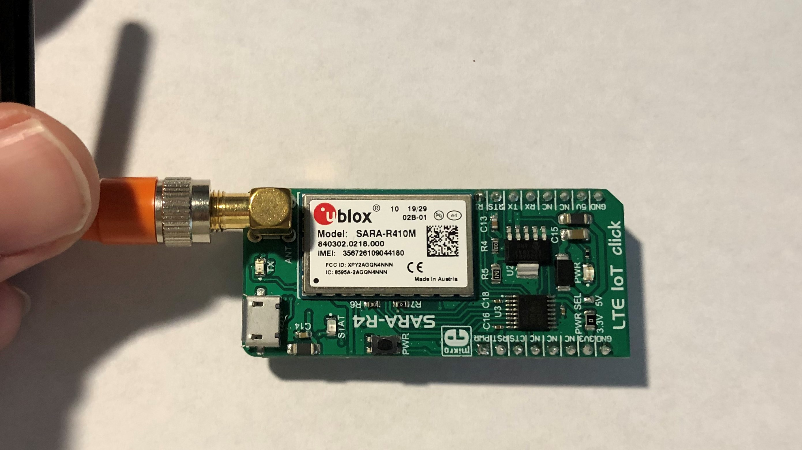</a>
2. Open the SIM holder on the u-blox SARA-R4 module and insert your SIM card. Be sure to close the SIM holder.
    + <a href="url">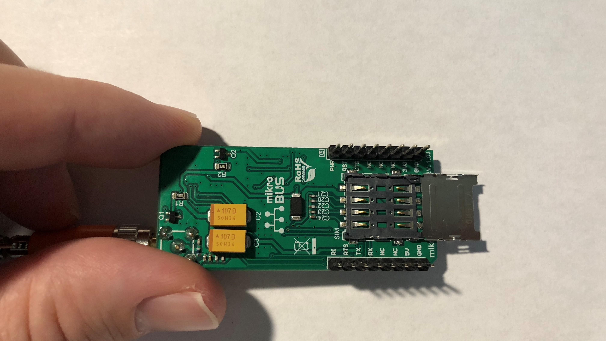</a>
    + <a href="url">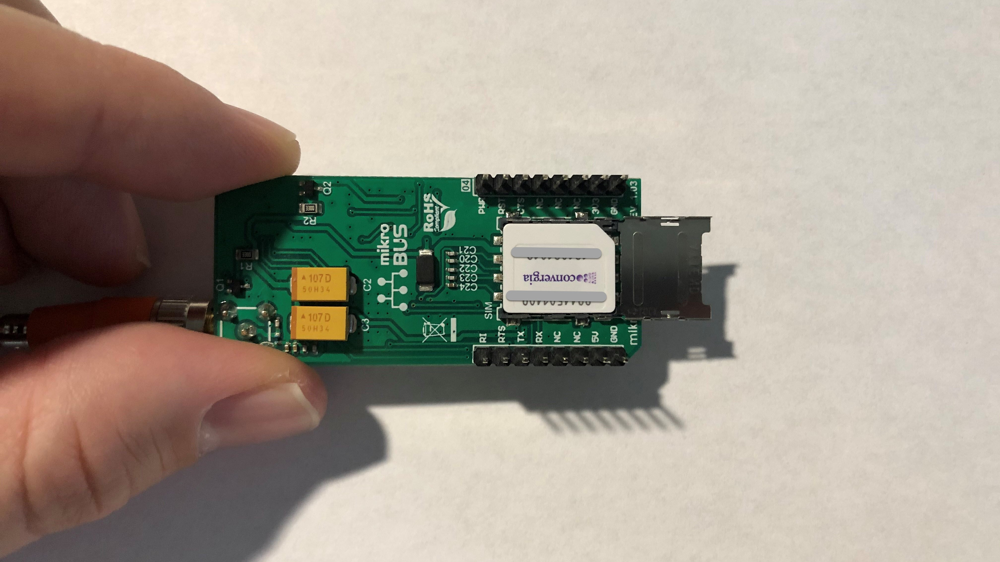</a>
    + <a href="url">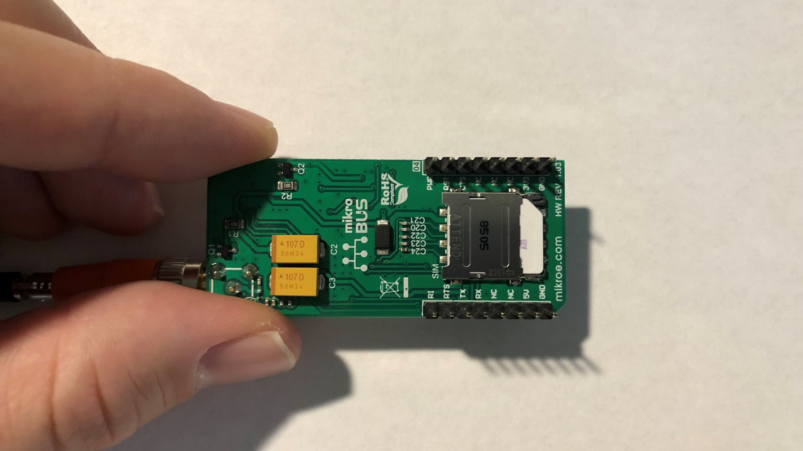</a>
3. Connect your u-blox SARA-R4 module to your AVR or PIC board using the click pins and header. Be sure to read the pin names and align the GND or GROUND pins.
    + <a href="url">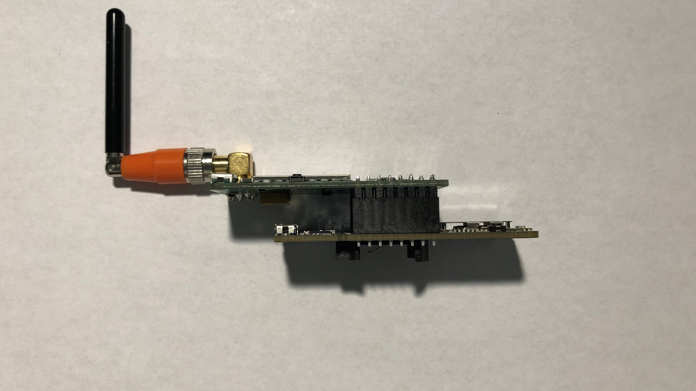</a>
4. Connect a USB to Micro-USB cable to your PC and the Micro-USB port of the PIC or AVR board.
    + <a href="url">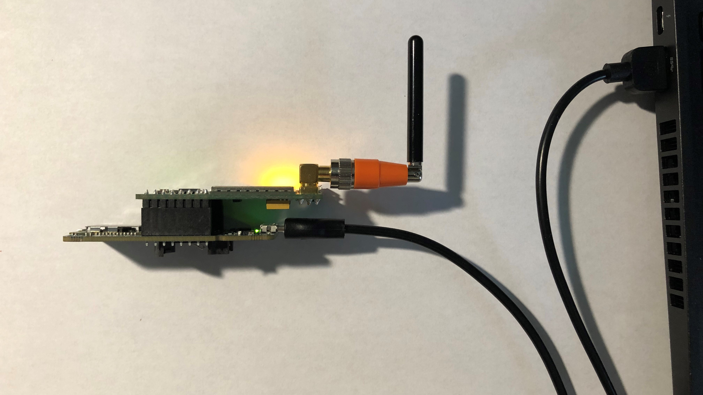</a>

---

## Flashing the Microchip Board

1. Download the correct .hex file based on your board and demo from our FCS GitHub page.
2. Ensure that your Microchip board is showing in your file system. Typically, it is displayed as “CURIOUSITY”.
3. Now drag and drop the .hex file you want to use over to your board labeled “CURIOUSITY”. This will program the board.
    + <a href="url">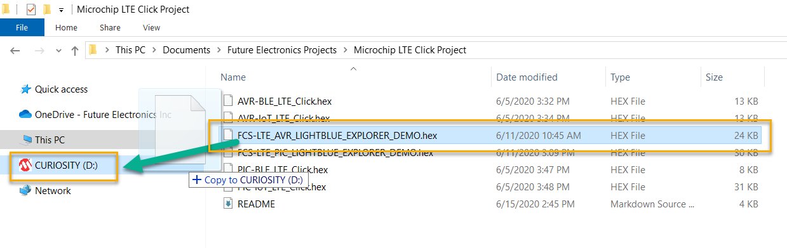</a>
4. Once the flashing is complete you’ll see both the Microchip board and the u-blox SARA-R4 power up, as indicated by their green and yellow LEDs respectively.
    + <a href="url">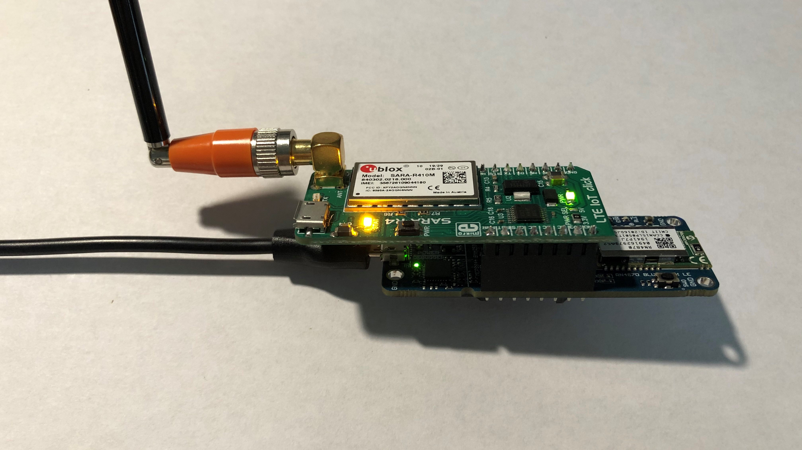</a>

---

## Running Through the BLE Demo

Make sure you've followed the steps above to appropriately set up your hardware and flash it with the correct .hex file. Now, follow the steps below.

1. Download and install the LightBlue Punchthrough app on your phone or tablet.
    + <a href="url">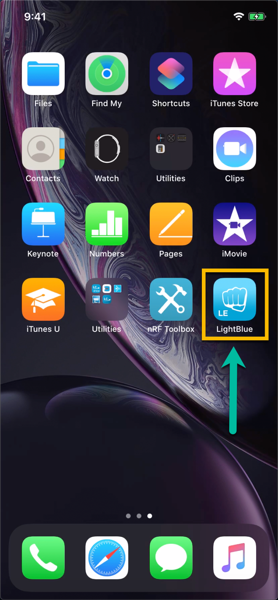</a>
2. Open the app and it will scan for nearby BLE devices. 
    + <a href="url">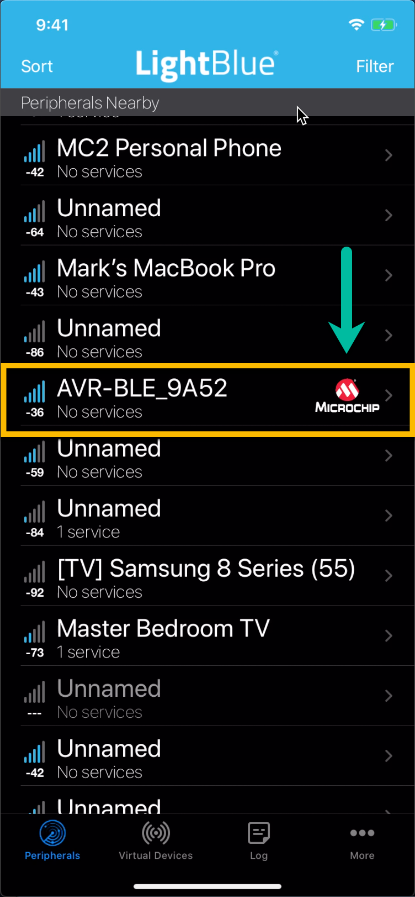</a>
3. You’ll be able to connect to your Microchip board over BLE and issue commands to the u-blox SARA-R4 cellular module using the "Serial" section.
    + <a href="url">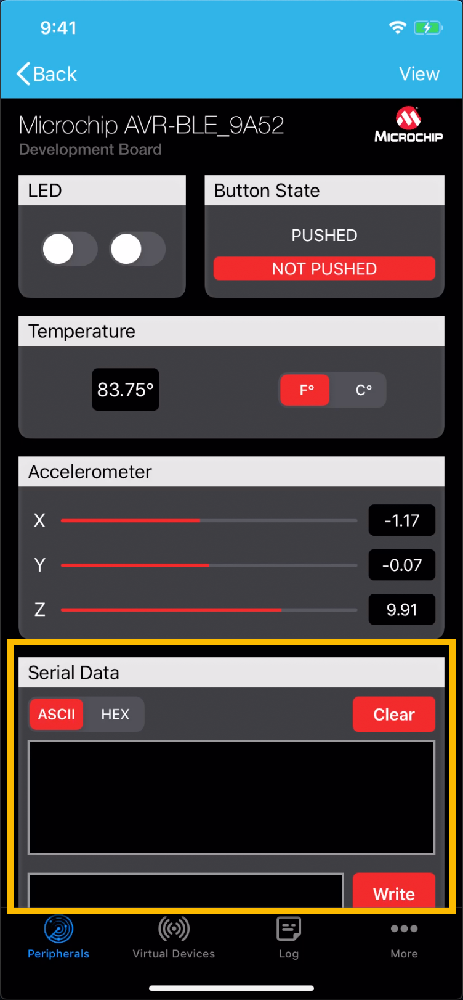</a>
4. You can start by sending “AT” which should give you an “OK” message back.
    + <a href="url">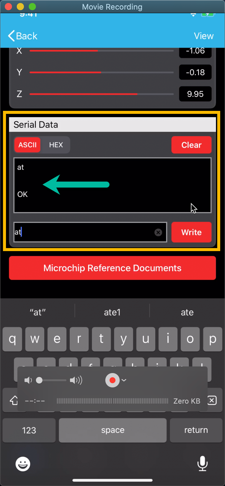</a>
5. You're now able to send whatever commands you would like to the SARA-R4. For more information on u-blox AT commands please refer to the guide below.
    - [AT Command Guide](https://www.u-blox.com/sites/default/files/SARA-R4_ATCommands_%28UBX-17003787%29.pdf)

---

## Expanding on the Demo Applications

- There is a small API available that will allow you to pass in data to write from the Microchip board to the u-blox SARA-R4 module.
    - The core function for this is lteClick_cmd(). Use this to pass in an array of data which will then be parsed and sent over the UART.
    - As of this revision the API resides in main.c but will be moved to its own driver file with expanded functionality in the future.
- You can combine this API with the very handy libraries and extensions provided by Microchip in the MPLAB X IDE in order to create your own application leveraging a Microchip MCU and a u-blox CAT-M1 cellular module.

---

## Useful Links

1. Future Electronics
    - [FCS Website](https://www.futureelectronics.com/our-solutions/iot-solutions#:~:text=The%20model%20adopted%20by%20Future,productivity%20and%20new%20revenue%20streams.)

2. Microchip
    - [Wi-Fi IoT Boards Used](https://www.microchip.com/design-centers/internet-of-things/amazon-web-services)
    - [BLE Boards Used](https://www.microchip.com/design-centers/internet-of-things/iot-dev-kits/avr-ble-and-pic-ble-development-boards)
    - [MPLAB X IDE](https://www.microchip.com/mplab/mplab-x-ide)
    - [Microchip PIC BLE GitHub](https://github.com/microchip-pic-avr-solutions/pic-lightblue-explorer-demo)
    - [Microchip AVR BLE GitHub](https://github.com/microchip-pic-avr-solutions/avr-lightblue-explorer-demo)
    - [Microchip PIC IoT GitHub](https://github.com/microchip-pic-avr-solutions/pic-iot-aws-sensor-node)
    - [Microchip AVR IoT GitHub](https://github.com/microchip-pic-avr-solutions/avr-iot-aws-sensor-node-mplab)

3. Ublox
    - [u-blox SARA-R4 Product Page](https://www.u-blox.com/en/product/sara-r4-series)
    - [Mikroe LTE Click (SARA-R4)](https://www.mikroe.com/lte-iot-click)
 

4. Taoglas
    - [Taoglas Website](https://www.taoglas.com/)

5. Convergia
    - [Convergia MVNO Website](https://www.convergia.io/en-ca/)

